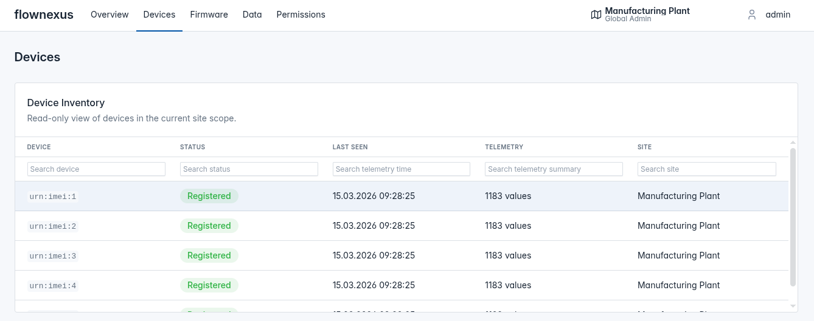

flownexus Overview
==================

flownexus is an open-source LwM2M device management framework built for IoT
developers. It combines a Leshan LwM2M server with a Django backend and Tabler
frontend to give you telemetry, application data, FOTA, and device control out
of the box.

Run the entire stack on your laptop, including emulated Zephyr devices.
Deploy the same setup on a single vserver and manage up to 10 k devices.

Data Flow
---------

1. Emulate firmware with Zephyr on `native_sim <https://docs.zephyrproject.org/latest/boards/native/native_sim/doc/index.html>`_
2. Device sends data via LwM2M
3. Leshan LwM2M server receives the data
4. Leshan forwards data to Django via REST API
5. Django visualizes the data

Getting Started
===============

Explore our `documentation <https://flownexus-lwm2m.github.io/flownexus>`_ to
learn more about the project and get started!

**⚠️ Warning: The framework is WIP and is not yet ready for production use.**
