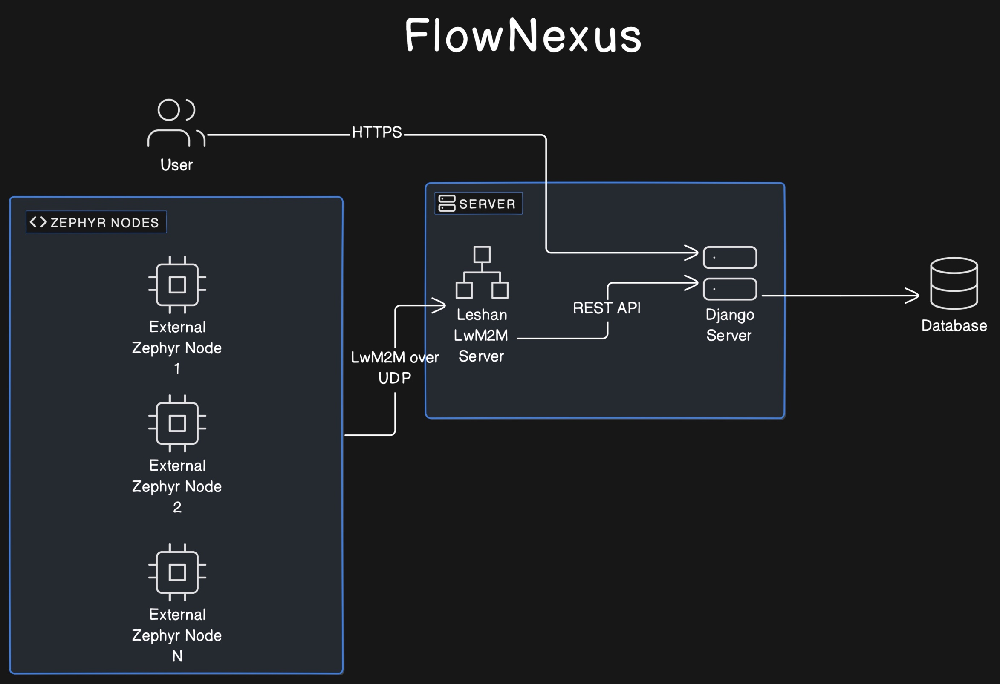

Documentation
==================

Overview
--------

This documentation describes a local server-based IoT system that leverages
the Lightweight Machine to Machine (LwM2M) protocol to communicate between
IoT devices running Zephyr OS and a backend server using Django. The
system does not depend on external cloud services and is designed to operate
fully within a local environment.

Features
........
* No dependencies of external services like AWS, MQTT brokers or similar. The
  system has to be able to run in a local environment.
* The main focus is the LwM2M protocol and the communication between Zephyr and
  the server.
* The system should show how to add data to a database and visualize it in a
  web application.
* The web application has to support a secure login and basic user management.
* Certificate based authentication and encryption.
* Server to read and observe resources from IoT Device.
* Server to write resources to IoT Devices.
* OTA Update.
* Receive logs from IoT Devices.

Key Components
--------------

IoT Devices
...........
These are typically resource-constrained devices
(limited energy and storage capabilities) that run Zephyr OS. They communicate
with the server using the UDP protocol to ensure constant connectivity,
even in low power states. These devices are programmed to handle tasks
like temperature sensing, location tracking, or any other telemetry
based on Zephyr applications. They communicate via the UDP protocol to
maintain a continuous link without needing frequent reconnections.
The IoT device has to support LwM2M. Mainly systems that run
Zephyr should be compatible. The application can e.g. be used with a dedicated
nRF9160 device or via a simulation like native_sim or in Renode. The nRF9160 is
a low power LTE-M and NB-IoT SoC that runs Zephyr OS. UDP is used as transport
protocol as it allows to keep devices connected even when the device is
sleeping for extended periods (TCP would require a new connection setup
typically after a few minutes)

LwM2M Server
............
The LwM2M server plays a critical role in managing communications with IoT devices.
It handles data transmission, device monitoring, and control commands, ensuring
that devices can report their telemetry data, receive configuration updates, and
execute commands sent by the server. The server's efficient management of these
tasks is essential for maintaining reliable communication with numerous IoT devices,
especially those with limited power and processing resources.

Terminology
...........

* **LwM2M:** Lightweight Machine to Machine protocol.
* **Leshan:** LwM2M server implementation as one main component of the system.
* **Backend**: Django instance that is responsible for the REST API, database
  and visualization.
* **Frontend**: Web application that visualizes the data from the backend,
  integrated into Django.
* **Endpoint**: IoT device that is connected to Leshan, represented by a unique
  Endpoint name.

Django Server
.............
The Django server hosts the REST API, manages the database, and provides a web interface
for data visualization and user management. This server acts as the backend
infrastructure that supports the entire IoT ecosystem by:

* **REST API**: Facilitates communication between the IoT devices and the server.
  The API endpoints handle requests for data uploads from devices, send control commands,
  and provide access to stored telemetry data.

* **Database Management**: Stores all the telemetry data, device information, user
  accounts, and configuration settings. The database ensures that data is organized,
  searchable, and retrievable in an efficient manner.

* **Web Interface**: Offers a user-friendly interface for data visualization and
  management. Through this interface, users can monitor device status, visualize
  telemetry data in real-time, manage user accounts, and configure device settings.

Database Model
..............

The database model is the core of the Django server. It aims to store
information according to the LwM2M resource model. The advantage is that data
can be stored in a generic way and the server can be extended with new
resources without changing the database schema.

The server application logic only has to handle higher level events. Those
events are situations where multiple resources are associated (e.g.
Temperature, Pressure, Humidity, Acceleration). Those multiple resources are
linked in the event, together with a timestamp. The event itself is represented
by the database model in a generic way, several custom event types can be
created by the application logic.

An Entity Relationship Diagram (ERD) is a visual representation of the database
schema. It is automatically generated from the Django models. ``sensordata`` is
the Django app that contains the application logic.

.. figure:: images/erd.svg

  Entity Relationship Diagram generated from Django models

**Device:** Represents IoT devices using the LwM2M protocol in the network,
identifiable by a universally unique ID alongside a human-readable name.

**ResourceType:** Defines resource data points comprehensively, annotating each
with a unique object-resource ID combination, a descriptive name, and
specifying the expected data type.

**Resource:** Captures individual data values from IoT devices, annotated with
timestamps, applicable data types, and linked to both the device and resource
type for which the data pertains.

**Event:** Serves as a collection point for significant occurrences reported by
devices, including composite events defined by enclosing object IDs. The server
application logic has to generate events based on matching timestamps or
received composite notifications from devices. Although individual resources
within an event may have different timestamps, the event itself encapsulates a
single timestamp.

**EventResource:** Acts as a junction table forming a many-to-many relationship
between events and their constituent resources, enabling flexible association
without direct modification to the core events or resources tables.

**DeviceOperation:** Represents actionable commands or processes targeted at
devices, tracking the operation type, status, and scheduling through
timestamps, also detailing the transmission attempts and last action.

**Firmware:** Stores metadata about firmware binaries that are available for
devices to download and install. Each record includes a version identifier, the
name of the file, a URL from where the device can retrieve the firmware, and
timestamps for tracking when each firmware record was created and last updated.

Getting Started
---------------
.. warning::

  The following setup guide is for a native Linux Machine. For MacOS or Windows
  consider creating a docker container build. One of the developers uses the following
  `devcontainer.json` build environment:

  .. code-block:: json

    {
      "name": "Ubuntu",
      "image": "mcr.microsoft.com/devcontainers/base:jammy",
      "runArgs": [
        "--cap-add=NET_ADMIN",
        "--cap-add=MKNOD",
        "--device=/dev/net/tun",
        "--sysctl=net.ipv6.conf.all.disable_ipv6=0",
        "--sysctl=net.ipv6.conf.default.disable_ipv6=0"
      ],
      "postCreateCommand": "apt-get update && apt-get install -y iproute2 && echo 'IPv6 is enabled.'",
      "remoteUser": "root"
    }

Before you we start with any development here are a few things you should get configured:

* Get the Zephyr SDK downloaded and configured in your root directory. You can find the instructions
  `here <https://docs.zephyrproject.org/latest/develop/toolchains/zephyr_sdk.html>`_.

* Setup a virtual environment for the project.

.. code-block:: console

  host:~$ sudo apt update && sudo apt upgrade
  host:~$ sudo apt install python3-pip python3.10-venv
  host:~$ python3.10 -m venv venv
  host:~$ source venv/bin/activate
  host:~$ pip install --upgrade pip && pip install west
  host:~$ west init -m https://github.com/jonas-rem/lwm2m_server --mr main flownexus_workspace
  host:~$ cd flownexus_workspace
  host:~/flownexus_workspace$ west update

Contributing to the Documentation
.................................

.. code-block:: console

  host:~$ sudo apt-get install default-jre plantuml graphviz
  host:~$ source venv/bin/activate
  host:~$ cd flownexus_workspace/lwm2m_server/doc
  host:lwm2m_server/doc$ pip install -r requirements.txt
  host:lwm2m_server/doc$ tox -e py3-html

Open the generated index.html in the doc/build directory in your browser.

Contributing to Django
......................
The Django server can also run locally, without the need of a docker container.
Make sure to create a virtual environment and install the requirements:

.. code-block:: console

  host:~$ source venv/bin/activate
  host:~$ cd flownexus_workspace/lwm2m_server/server/django
  host:lwm2m_server/server/django$ pip install -r requirements.txt
  host:lwm2m_server/server/django$ ./django_start.sh

The Django server should now be up and running under the following URL:
``http://localhost:8000/admin``. The admin login is ``admin`` and the password

.. warning::

  Do not forget to change the password to the admin console as well as other
  settings like SECRET_KEY, DEBUG flag in a production environment!

There are also unit tests defined, which test the deserializer in Django, which
parses the json payload from the Rest API. You can run the unit tests with the
following command:

.. code-block:: console

  host:~/flownexus_workspace/lwm2m_server/server/django$ python manage.py test sensordata
  Found 2 test(s).
  Creating test database for alias 'default'...
  ----------------------------------------------------------------------
  Ran 2 tests in 0.008s

  OK
  Destroying test database for alias 'default'...

Contributing to Leshan
......................
The Leshan server can also run locally, without the need of a docker container.

.. code-block:: console

  host:~$ sudo apt update
  host:~$ sudo apt install openjdk-17-jdk maven
  host:~$ source venv/bin/activate
  host:~$ cd flownexus_workspace/lwm2m_server/server/leshan
  host:lwm2m_server/server/leshan$ ./leshan_build_run.sh

The Leshan server should now be up and running under the following URL: ``http://localhost:8080``.

Communication & Interfaces
--------------------------

The communication between IoT devices and Leshan is specified by the OMA LwM2M
standard:

- `LwM2M core specification v1.1.1`_
- `LwM2M transport binding v1.1.1`_

.. _LwM2M core specification v1.1.1: https://www.openmobilealliance.org/release/LightweightM2M/V1_1_1-20190617-A/OMA-TS-LightweightM2M_Core-V1_1_1-20190617-A.pdf
.. _LwM2M transport binding v1.1.1: https://www.openmobilealliance.org/release/LightweightM2M/V1_1_1-20190617-A/OMA-TS-LightweightM2M_Transport-V1_1_1-20190617-A.pdf

The standard describes how the LwM2M server (Leshan) works, however, it does
not describe how to connect a backend server to Leshan. The backend is
responsible for storing the data in a database and implementing application
logic. A frontend can access the data in the database and visualize outward
facing user interfaces. Leshan acts as a gateway between Endpoints and the
backend. There should be no application specific logic implemented in Leshan.

In order to communicate and exchange data, both components (Leshan LwM2M Server
and Django) post data to each other's ReST APIs. Communication is typically
triggered by IoT devices sending data or the user/application requesting data
from devices.

Data Flow: Backend -> Device
............................

IoT devices usually operate in queue mode, meaning they are not always online.
The LwM2M Server is aware of the current status of a device (Online/Offline)
and communicates this status to the backend server. Leshan does not queue
pending data that should be sent to the device when it comes online. The
backend server must handle this by itself so it has to have a representation of
the current status of each device as well as the data to be send. The resource
table ``DeviceOperation`` is used to store pending operations that should be
sent to the endpoint while it is online.

Once an endpoint updates it's registration (LwM2M Update Operation) Leshan
notifies the backend. The backend checks the ``DeviceOperation`` table for
pending operations and sends them to the device by posting to the Leshan hosted
ReST API. Leshan keeps the post call open until the device acknowledges the
operation or a timeout is generated. Endpoints can be slow to respond (several
Seconds), so the backend has to handle the ReST API call in an asynchronous
manner. By only sending data to endpoints while they are online, the backend
can be sure that the ReST API calls are not open for a long time.

Asynchronous Communication
...........................

Given that endpoints are comparably slow to respond, handling communication
asynchronously is essential for efficient operation. This can be effectively
managed using Celery, a distributed task queue. When Leshan notifies the
backend of an endpoint status update, Celery can be used to handle the
long-running API calls, ensuring that the backend remains responsive and
scalable. As the backend communicates with many endpoints simultaneously, an
efficient queing mechanism is essential to ensure that the system remains
responsive and scalable.

Before the backend executes the API call, it updates the endpointOperation
status to ``SENDING``, indicating an ongoing operation.

Once the API call is complete the database will be updated with the result
(e.g. ``CONFIRMED``, ``FAILED``, ``QUEUED``) depending on the result of the
request. The ``FAILED`` status is assigned after 3 attempts. Retransmissions are
triggered when the endpoint updates it's registration the next time.

Example Communication
.....................

The following example shows how the backend server can send a firmware download
link resource ``Package URI 5/0/1`` to an endpoint:

#. User creates new ``DeviceOperation``: resource path ``5/0/1``, value
   ``https://url.com/fw.bin``.
#. Backend checks endpoint online status.
#. If endpoint is offline, no further action is taken right away.
#. Endoint comes online, Leshan sends update to the backend.
#. Backend checks ``DeviceOperation`` table for pending operations for the
   endpoint.
#. Finds pending operation, send resource to endpoint via the Leshan ReST API.
#. Pending operation is marked ``completed`` if the endpoint acknowledges the
   operation.

IoT Devices with Zephyr
.......................

As device management protocol LwM2M is used. Zephyr offers a LwM2M client at
``subsys/net/lib/lwm2m``. This LwM2M client sample application implements the
LwM2M library and establishes a connection to an LwM2M server. The example can
be build with the following command:

.. code-block:: console

  host:~/flownexus_workspace/lwm2m_server$ west build -b nrf9161dk_nrf9160_ns fw_test/lwm2m_client -p
  host:~/flownexus_workspace/lwm2m_server$ west flash --recover

LwM2M Client Simulation
.......................

The Zephyr application can run in simulation mode. This allows to test all
components locally. Once leshan and Zephyr are running, the Zephyr application
can be started in emulation with the following command:

.. code-block:: console

  host:~/flownexus_workspace/lwm2m_server$ ./zephyr_build_run_sim.sh
  *** Booting nRF Connect SDK zephyr-v3.5.0-3024-g7c3e830729b7 ***
  [00:00:00.000,000] <dbg> net_lwm2m_engine: lwm2m_engine_init: LWM2M engine socket receive thread started
  [00:00:00.000,000] <dbg> net_lwm2m_obj_security: security_create: Create LWM2M security instance: 0
  [00:00:00.000,000] <dbg> net_lwm2m_obj_server: server_create: Create LWM2M server instance: 0
  [00:00:00.000,000] <dbg> net_lwm2m_obj_device: device_create: Create LWM2M device instance: 0
  [00:00:00.010,000] <dbg> net_lwm2m_obj_firmware: firmware_create: Create LWM2M firmware instance: 0
  [00:00:00.010,000] <inf> net_config: Initializing network
  [00:00:00.010,000] <inf> net_config: IPv4 address: 192.0.2.1

You should see the following output in the docker console or in the most recent
log file in ``server/logs/``:

.. code-block:: console

  host:lwm2m_server/docker_compose$ leshan-1  | LeshanServer started
  leshan-1  | new device registered: qemu_x86
  leshan-1  | Onboarding qemu_x86
  leshan-1  | Resources:
  leshan-1  | </3>
  leshan-1  | </3/0>
  leshan-1  | </3/0/0>
  leshan-1  | </3/0/1>
  [..]

Additionally you can see the device in the Django server under
``http://localhost:8000/admin/sensordata/endpoint/``. You should see that the
LAST UPDATED field contains a recent timestamp.

.. figure:: images/django_local.png

  Endpoints table in Django

Deployment
----------

Container Environment
.....................

Both components run in a Docker container. The Leshan server is running in a
``openjdk:17-slim`` container and the Django server is running in a
``python:3.11-slim`` container. This allows for an easy and reproducible setup
of the server.

  .. uml::
   :caption: Both components running in one machine using Docker Compose

   @startuml
   package "Docker Compose Environment"  #DDDDDD {
     [Leshan] as Leshan
     [Django] as Django
     database "Database" as DB
     Leshan <-right-> Django : REST API
     Django <-down-> DB
   }
   @enduml

The following diagram shows the Docker Compose environment. The file
``docker-compose.yml`` defines the services and their configuration. The file
``Dockerfile.leshan`` defines the Leshan container and the file
``Dockerfile.django`` defines the Django container.

The container can be build and started with the following commands:

.. code-block:: console

  host:~/flownexus_workspace/lwm2m_server/server$ docker compose build
  [+] Building 0.5s (20/20) FINISHED                               docker:default
   => [leshan internal] load build definition from Dockerfile.leshan         0.0s
   => [leshan internal] load metadata for docker.io/library/openjdk:17-slim  0.4s
   => [django internal] load build definition from Dockerfile.django         0.0s
   => [django internal] load metadata for docker.io/library/python:3.11-sli  0.4s
   => [leshan 1/5] FROM docker.io/library/openjdk:17-slim@sha256:aaa3b3cb27  0.0s
   => [django 1/5] FROM docker.io/library/python:3.11-slim@sha256:d11b9bd5e  0.0s
   => CACHED [leshan 2/5] WORKDIR /leshan                                    0.0s
   => CACHED [leshan 3/5] COPY . /leshan/                                    0.0s
   => CACHED [leshan 4/5] RUN apt-get update &&     apt-get install -y mave  0.0s
   => CACHED [leshan 5/5] RUN chmod +x /leshan/leshan_build_run.sh           0.0s
   => => exporting layers                                                    0.0s
   => => writing image sha256:a017577ba2b175374148f5c3f128ac117ba5436ceaeff  0.0s
   => => naming to docker.io/library/server-leshan                           0.0s
   => CACHED [django 2/5] WORKDIR /django                                    0.0s
   => CACHED [django 3/5] COPY . /django/                                    0.0s
   => CACHED [django 4/5] RUN pip install --no-cache-dir -r /django/require  0.0s
   => CACHED [django 5/5] RUN chmod +x /django/django_start.sh               0.0s
   => => writing image sha256:1c88f1227753b08cf994c4e61d5cdcf97d68f260c99ad  0.0s
   => => naming to docker.io/library/server-django                           0.0s

.. code-block:: console

  host:~/flownexus_workspace/lwm2m_server/server$ docker compose up
  [+] Running 2/0
   ✔ Container server-leshan-1  Created                                      0.0s
   ✔ Container server-django-1  Created                                      0.0s
  Attaching to django-1, leshan-1
  [..]
  django-1  | Starting development server at http://0.0.0.0:8000/
  leshan-1  | [main] INFO org.eclipse.leshan.server.LeshanServer - CoAP over UDP endpoint based on Californium library available at coap://0.0.0.0:5683.
  leshan-1  | LeshanServer started
  ^CGracefully stopping... (press Ctrl+C again to force)
  [+] Stopping 2/2
   ✔ Container server-django-1  Stopped                                     10.3s
   ✔ Container server-leshan-1  Stopped                                     10.5s
