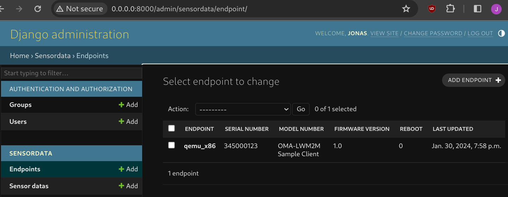

Documentation
==================

Overview
--------
General Requirements
^^^^^^^^^^^^^^^^^^^^

* No dependencies of external services like AWS, MQTT brokers or similar. The
  system has to be able to run in a local environment.
* The main focus is the LwM2M protocol and the communication between Zephyr and
  the server.
* The system should show how to add data to a database and visualize it in a
  web application.
* The web application has to support a secure login and basic user management.

Platform Features
^^^^^^^^^^^^^^^^^

* Certificate based authentication and encryption.
* Server to read and observe resources from IoT Device.
* Server to write resources to IoT Devices.
* OTA Update.
* Receive logs from IoT Devices.

IoT Device
^^^^^^^^^^

An IoT device is a resource constrained (energy, flash..) that is connected to
the internet. The IoT device has to support LwM2M. Mainly systems that run
Zephyr should be compatible. The application can e.g. be used with a dedicated
nRF9160 device or via a simulation like native_sim or in Renode. The nRF9160 is
a low power LTE-M and NB-IoT SoC that runs Zephyr OS. UDP is used as transport
protocol as it allows to keep devices connected even when the device is
sleeping for extended periods (TCP would require a new connection setup
typically after a few minutes).

Django
------
Django
------

The Django server can also run locally, without the need of a docker container.
Make sure to create a virtual environment and install the requirements:

.. code-block:: console

  host:lwm2m_server/server/django$ python3 -m venv venv
  host:lwm2m_server/server/django$ source venv/bin/activate
  host:lwm2m_server/server/django$ pip install -r requirements.txt
  host:lwm2m_server/server/django$ python manage.py runserver

Unless you add new files, you can keep the server running while modifying the
server. The Django server should now be up and running under the following URL:
``http://localhost:8000/admin``.

Migrate Database Model
^^^^^^^^^^^^^^^^^^^^^^^

.. code-block:: console

   host:lwm2m_server/server/django$ python manage.py makemigrations sensordata
   host:lwm2m_server/server/django$ python manage.py migrate

Run Django Unit Tests
^^^^^^^^^^^^^^^^^^^^^

There are unit tests defined, which test the deserializer in Django, which
parses the json payload from the Rest API. You can run the unit tests with the
following command:

.. code-block:: console

  host:lwm2m_server/server/django$ python3 manage.py test sensordata
  Found 2 test(s).
  Creating test database for alias 'default'...
  ----------------------------------------------------------------------
  Ran 2 tests in 0.008s

  OK
  Destroying test database for alias 'default'...

Entity Relationship Diagram (ERD)
^^^^^^^^^^^^^^^^^^^^^^^^^^^^^^^^^^

An Entity Relationship Diagram (ERD) is a visual representation of the database
schema. It is be automatically generated from the Django models.

``sensordata`` is the Django app that contains the application logic.

.. figure:: images/erd.svg

  Entity Relationship Diagram generated from Django models

Leshan LwM2M
------------
Leshan LwM2M
------------

For testing the Lwm2m server can run locally, without the need of a docker
container:

.. code-block:: console

   host:lwm2m_server/server/leshan$ ./leshan_build_run.sh

Overview and Interfaces
^^^^^^^^^^^^^^^^^^^^^^^

The server consists of two components. The LwM2M server and the Django server.
The LwM2M server is responsible for the communication with the IoT device. The
Django server is responsible for the REST API, database and visualization. The
two components are connected via a REST API.

  .. uml::
   :caption: Both components running in one machine

   @startuml
   left to right direction
   !define LESHAN
   !define DJANGO
   !define NODE
   package "Server" #DDDDDD {
     [Leshan LwM2M Server] as Leshan
     [Django Server\n- serves REST API\n- maintains db Model\n- DB] as Django
   }

   [External Zephyr Node 1] as Node1
   [External Zephyr Node 2] as Node2
   [External Zephyr Node N] as NodeN

   Node1 --> Leshan : LwM2M over UDP
   Node2 --> Leshan : LwM2M over UDP
   NodeN --> Leshan : LwM2M over UDP
   Leshan -right-> Django : REST API\nSensor Val, States..
   :User: -up-> Django : HTTPS
   @enduml

IoT Devices with Zephyr
-----------------------
IoT Devices with Zephyr
-----------------------

As device management protocol LwM2M is used. Zephyr offers a LwM2M client at
``subsys/net/lib/lwm2m``. This LwM2M client sample application implements the
LwM2M library and establishes a connection to an LwM2M server. The example can
be build with the following command:

.. code-block:: console

  host:lwm2m_server$ west build -b nrf9161dk_nrf9160_ns fw_test/lwm2m_client -p
  host:lwm2m_server$ west flash --recover

Simulation
^^^^^^^^^^

The Zephyr application can run in simulation mode. This allows to test all
components locally. Once leshan and Zephyr are running, the Zephyr application
can be started in emulation with the following command:

.. code-block:: console

  host:lwm2m_server/server$ zephyr_build_run_sim.sh

  *** Booting nRF Connect SDK zephyr-v3.5.0-3024-g7c3e830729b7 ***
  [00:00:00.000,000] <dbg> net_lwm2m_engine: lwm2m_engine_init: LWM2M engine socket receive thread started
  [00:00:00.000,000] <dbg> net_lwm2m_obj_security: security_create: Create LWM2M security instance: 0
  [00:00:00.000,000] <dbg> net_lwm2m_obj_server: server_create: Create LWM2M server instance: 0
  [00:00:00.000,000] <dbg> net_lwm2m_obj_device: device_create: Create LWM2M device instance: 0
  [00:00:00.010,000] <dbg> net_lwm2m_obj_firmware: firmware_create: Create LWM2M firmware instance: 0
  [00:00:00.010,000] <inf> net_config: Initializing network
  [00:00:00.010,000] <inf> net_config: IPv4 address: 192.0.2.1

You should see the following output in the docker console or in the most recent
log file in ``server/logs/``:

.. code-block:: console

  host:lwm2m_server/docker_compose$ leshan-1  | LeshanServer started
  leshan-1  | new device registered: qemu_x86
  leshan-1  | Onboarding qemu_x86
  leshan-1  | Resources:
  leshan-1  | </3>
  leshan-1  | </3/0>
  leshan-1  | </3/0/0>
  leshan-1  | </3/0/1>
  [..]

Additionally you can see the device in the Django server under
``http://localhost:8000/admin/sensordata/endpoint/``. You should see that the
LAST UPDATED field contains a recent timestamp.

  Endpoints table in Django

Deployment
----------
----------

Container Environment
^^^^^^^^^^^^^^^^^^^^^

Both components run in a Docker container. The Leshan server is running in a
``openjdk:17-slim`` container and the Django server is running in a
``python:3.11-slim`` container. This allows for an easy and reproducible setup
of the server.

  .. uml::
   :caption: Both components running in one machine using Docker Compose

   @startuml
   package "Docker Compose Environment"  #DDDDDD {
     [Leshan] as Leshan
     [Django] as Django
     database "Database" as DB
     Leshan <-right-> Django : REST API
     Django <-down-> DB
   }
   @enduml

The following diagram shows the Docker Compose environment. The file
``docker-compose.yml`` defines the services and their configuration. The file
``Dockerfile.leshan`` defines the Leshan container and the file
``Dockerfile.django`` defines the Django container.

The container can be build and started with the following commands:

.. code-block:: console

  host:lwm2m_server/server$ docker compose build
  [+] Building 0.5s (20/20) FINISHED                               docker:default
   => [leshan internal] load build definition from Dockerfile.leshan         0.0s
   => [leshan internal] load metadata for docker.io/library/openjdk:17-slim  0.4s
   => [django internal] load build definition from Dockerfile.django         0.0s
   => [django internal] load metadata for docker.io/library/python:3.11-sli  0.4s
   => [leshan 1/5] FROM docker.io/library/openjdk:17-slim@sha256:aaa3b3cb27  0.0s
   => [django 1/5] FROM docker.io/library/python:3.11-slim@sha256:d11b9bd5e  0.0s
   => CACHED [leshan 2/5] WORKDIR /leshan                                    0.0s
   => CACHED [leshan 3/5] COPY . /leshan/                                    0.0s
   => CACHED [leshan 4/5] RUN apt-get update &&     apt-get install -y mave  0.0s
   => CACHED [leshan 5/5] RUN chmod +x /leshan/leshan_build_run.sh           0.0s
   => => exporting layers                                                    0.0s
   => => writing image sha256:a017577ba2b175374148f5c3f128ac117ba5436ceaeff  0.0s
   => => naming to docker.io/library/server-leshan                           0.0s
   => CACHED [django 2/5] WORKDIR /django                                    0.0s
   => CACHED [django 3/5] COPY . /django/                                    0.0s
   => CACHED [django 4/5] RUN pip install --no-cache-dir -r /django/require  0.0s
   => CACHED [django 5/5] RUN chmod +x /django/django_start.sh               0.0s
   => => writing image sha256:1c88f1227753b08cf994c4e61d5cdcf97d68f260c99ad  0.0s
   => => naming to docker.io/library/server-django                           0.0s

.. code-block:: console

  host:lwm2m_server/server$ docker compose up
  [+] Running 2/0
   ✔ Container server-leshan-1  Created                                      0.0s
   ✔ Container server-django-1  Created                                      0.0s
  Attaching to django-1, leshan-1
  [..]
  django-1  | Starting development server at http://0.0.0.0:8000/
  leshan-1  | [main] INFO org.eclipse.leshan.server.LeshanServer - CoAP over UDP endpoint based on Californium library available at coap://0.0.0.0:5683.
  leshan-1  | LeshanServer started
  ^CGracefully stopping... (press Ctrl+C again to force)
  [+] Stopping 2/2
   ✔ Container server-django-1  Stopped                                     10.3s
   ✔ Container server-leshan-1  Stopped                                     10.5s
