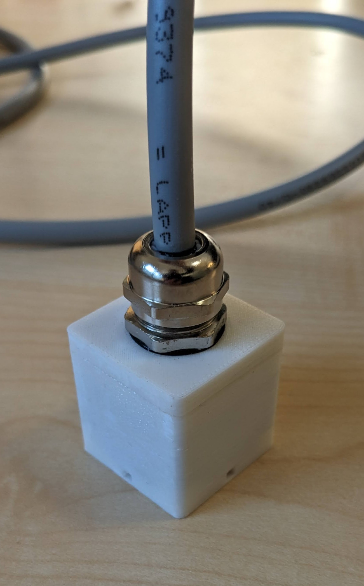
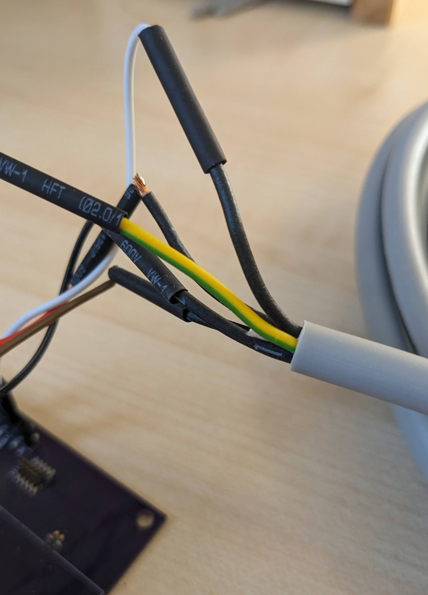

Hardware
--------

Pressure Sensor
...............

The pressure sensor comes encased in a waterproof housing, ensuring that the
device can reliably function even when immersed in water. This sensor connects
to a system through its cable, which facilitates communication via the I2C
protocol with the help of an SDA and an SDL line.

The table states how the pressure sensor is connected to the cable. The wires
of the 5 pin cable are named PE and numbers ranging form 1-4.

.. table:: Pinout Pressure Sensor Cable

  +---------+--------------+
  | **Pin** | **Function** |
  +=========+==============+
  | PE      | GND          |
  +---------+--------------+
  | 1       | I2C SDA      |
  +---------+--------------+
  | 2       | I2C SDL      |
  +---------+--------------+
  | 3       | Interrupt    |
  +---------+--------------+
  | 4       | VCC 1V8      |
  +---------+--------------+

  Pressure Sensor with waterproof housing

  Pressure Sensor cable connection

