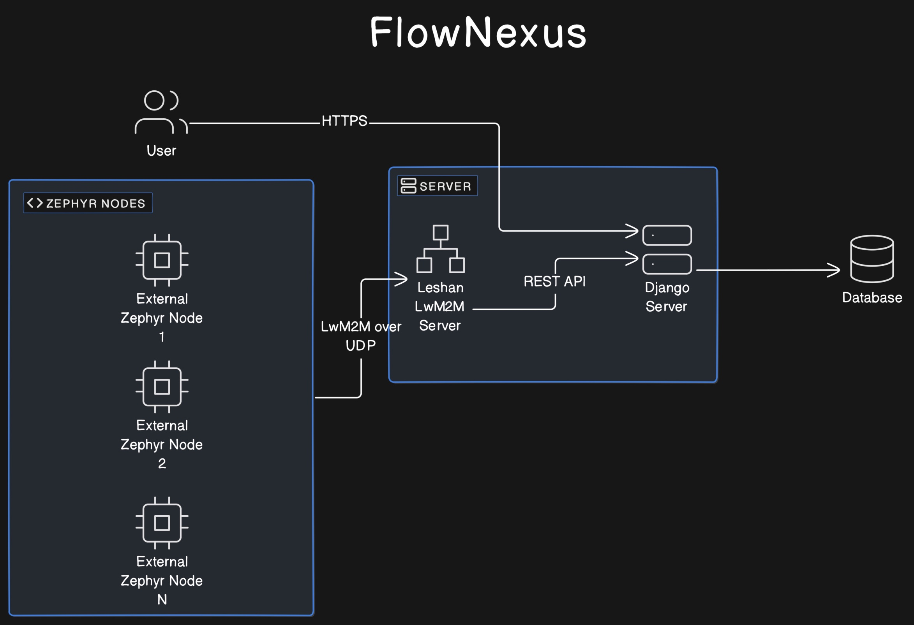

Overview
========

This documentation describes a local server-based IoT system that leverages
the Lightweight Machine to Machine (LwM2M) protocol to communicate between
IoT devices running Zephyr OS and a backend server using Django. The
system does not depend on external cloud services and is designed to operate
fully within a local environment.

Features
--------

* No dependencies of external services like AWS, MQTT brokers or similar. The
  system has to be able to run in a local environment.
* The main focus is the LwM2M protocol and the communication between Zephyr and
  the server.
* The system should show how to add data to a database and visualize it in a
  web application.
* The web application has to support a secure login and basic user management.
* Certificate based authentication and encryption.
* Server to read and observe resources from IoT Device.
* Server to write resources to IoT Devices.
* OTA Update.
* Receive logs from IoT Devices.

Key Components
--------------

IoT Devices
...........
These are typically resource-constrained devices
(limited energy and storage capabilities) that run Zephyr OS. They communicate
with the server using the UDP protocol to ensure constant connectivity,
even in low power states. These devices are programmed to handle tasks
like temperature sensing, location tracking, or any other telemetry
based on Zephyr applications. They communicate via the UDP protocol to
maintain a continuous link without needing frequent reconnections.
The IoT device has to support LwM2M. Mainly systems that run
Zephyr should be compatible. The application can e.g. be used with a dedicated
nRF9160 device or via a simulation like native_sim or in Renode. The nRF9160 is
a low power LTE-M and NB-IoT SoC that runs Zephyr OS. UDP is used as transport
protocol as it allows to keep devices connected even when the device is
sleeping for extended periods (TCP would require a new connection setup
typically after a few minutes)

LwM2M Server
............
The LwM2M server plays a critical role in managing communications with IoT devices.
It handles data transmission, device monitoring, and control commands, ensuring
that devices can report their telemetry data, receive configuration updates, and
execute commands sent by the server. The server's efficient management of these
tasks is essential for maintaining reliable communication with numerous IoT devices,
especially those with limited power and processing resources.
